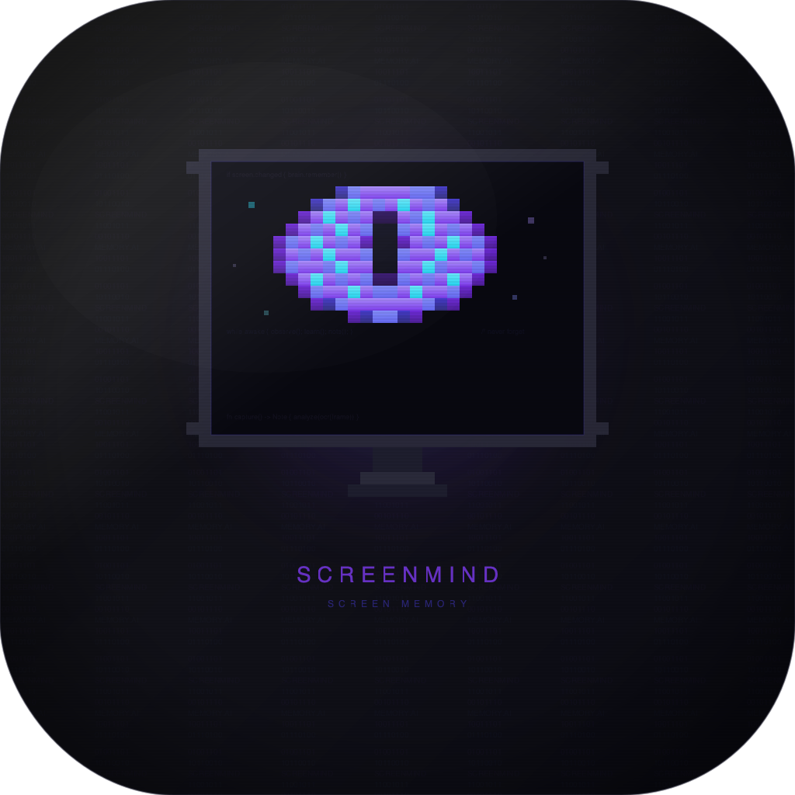

<p align="center">
  
</p>

<h1 align="center">ScreenMind</h1>

<p align="center">
  <strong>Your second brain that watches your screen so you don't have to remember everything.</strong>
</p>

<p align="center">
  <a href="#installation">Install</a> ·
  <a href="#how-it-works">How It Works</a> ·
  <a href="#features">Features</a> ·
  <a href="#cli">CLI</a> ·
  <a href="#api">API</a> ·
  <a href="#privacy">Privacy</a> ·
  <a href="https://github.com/pkmdev-sec/screenmind/releases">Download</a>
</p>

<p align="center">
  
  
  
  
  
  
</p>

---

## The Problem

You're deep in a research rabbit hole. Tabs everywhere. You find *that one Stack Overflow answer*, *that perfect API doc*, *that Slack message with the decision your team made*. Two hours later... gone. You can't find it. You can't even remember which app it was in.

**Sound familiar?**

## The Solution

**ScreenMind** sits quietly in your menu bar and does one thing really well: it watches what's on your screen, understands what matters, and writes it down for you.

No manual screenshots. No copy-pasting into notes. No "I'll bookmark this later" promises you never keep. It just... remembers.

## How It Works

ScreenMind runs a smart multi-stage pipeline that's designed to be invisible:

```
Event Trigger → Screen Capture → Change Detection → AX Tree / OCR → Redaction →
Skip Rules → Stealth Check → Content Dedup → AI Analysis → Storage → Export
```

1. **Triggers** on meaningful events (app switch, typing pause, scroll stop, clipboard) — not fixed timers
2. **Captures** your screen on-demand (active window, multi-display aware, screen-lock aware)
3. **Reads** text via Accessibility APIs (10x faster) with OCR fallback (Apple Vision)
4. **Redacts** sensitive data (credit cards, API keys, passwords) + ML-based PII detection
5. **Evaluates** user-defined skip rules and stealth mode to filter unwanted content
6. **Deduplicates** aggressively with 5-layer defense (hash + Jaccard + cooldown + content + buffer)
7. **Analyzes** content with AI — app-specific prompts, vision support, context windows
8. **Saves** to SwiftData + exports to Obsidian, JSON, Markdown, Notion, Logseq, Slack, or Webhook
9. **Encrypts** screenshots and notes at rest with AES-256-GCM (optional)
10. **Indexes** semantically for instant vector search and knowledge graph discovery

## Features

### Smart Capture
- **Event-driven capture** — triggers on app switch, typing pause, scroll stop, clipboard, not fixed timers (40-60% less CPU, 80% less storage)
- **Accessibility tree extraction** — reads UI text via macOS AX APIs (10x faster than OCR), falls back to Vision OCR for images/remote desktops
- **3-tier power profiles** — Performance (AC), Balanced (battery >40%), Saver (battery ≤40%) with thermal override
- **Screen lock detection** — auto-skips capture when screen locked via CGSession polling
- **Hot frame cache** — in-memory cache of recent 2000 frames for instant timeline lookups
- Multi-display support (captures from display with active window)
- Active-window cropping for focused screenshots
- Timer fallback mode (5s active / 30s idle) if event-driven disabled
- Excluded apps list (skip sensitive or noisy apps)
- **Manual capture** with `Cmd+Opt+Shift+C` for on-demand notes
- **Screenshot diffing** — pixel-level comparison with connected component analysis
- **6x frame downscaling** before perceptual hash comparison (30-50% faster change detection)

### Multi-Provider AI
- **Claude** (Anthropic) — default, supports vision
- **OpenAI** (GPT-4o, GPT-4o-mini) — supports vision
- **Ollama** (fully offline, local models)
- **Gemini** (Google, via OpenAI compat) — supports vision
- **Custom** (any OpenAI-compatible endpoint)
- Per-provider API key, base URL, and model configuration
- One-click connection testing
- Shared prompt system (consistent quality across providers)
- **Custom prompts per app** — different AI behavior for Xcode vs Slack vs Chrome
- **Multi-modal vision** — sends screenshot to AI for visual understanding (not just OCR text)
- **Context windows** — AI sees last N notes for continuity across captures
- **AI feedback learning** — rate notes thumbs up/down, AI adapts over time

### Visual Intelligence
- **UI element detection** — identifies buttons, text fields, dialogs, menus via Apple Vision
- **Screenshot diffing** — highlights what changed between captures with region analysis
- **Chart detection** — recognizes charts/diagrams and adds specialized extraction prompts

### Intelligent Notes
- Structured, actionable notes from screen content
- Extracts URLs, code snippets, decisions, action items, and key data
- Smart categorization: coding, research, meetings, communication, reading, terminal
- Obsidian-compatible wiki-links and tags
- Smart tag suggestions that learn from your note history
- **Meeting summaries** — combines screen + audio + calendar context into action-item summaries

### Visual Timeline
- Browse captures visually in a gallery or list view
- Date range filtering (today, week, month, all time)
- Category and app filtering
- Debounced full-text search across all notes
- Screenshot overlay with full-resolution viewing
- `Cmd+Shift+T` keyboard shortcut

### Multi-Format Export
- **Obsidian Markdown** — daily folders, frontmatter, wiki-links, daily summaries
- **JSON** — one file per note for data pipelines and scripts
- **Flat Markdown** — simple .md without vault structure
- **Notion** — direct export via Notion API with database properties
- **Logseq** — journal format with properties syntax
- **Slack** — post note summaries to channels via Incoming Webhooks
- **Webhook** — POST note JSON to any URL (Zapier, Make.com, n8n)
- SSRF protection on webhooks (blocks private IPs)
- Multiple exporters can run simultaneously

### Privacy & Security
- **Content redaction** — auto-strips credit cards, SSNs, API keys, passwords, emails before AI
- **ML-based PII detection** — NaturalLanguage NLTagger identifies names, places, organizations
- **PII sensitivity levels** — off, low (names), medium (+places), high (+all entities)
- **Custom redaction patterns** — add your own regex patterns
- **Skip rules** — text contains, app matches, window title matches, regex patterns
- **Stealth mode** — auto-pauses in sensitive apps (1Password, Bitwarden, banking, incognito windows)
- **Screenshot encryption** — AES-256-GCM with key in macOS Keychain
- **Note encryption** — AES-256-GCM for note title, summary, and details fields
- **Master password** — PBKDF2 key derivation (600,000 iterations) for vault protection
- **Vault lock** — Touch ID / password with auto-lock after configurable timeout
- **Audit log** — CSV trail of all captured, skipped, redacted, and exported events
- **GDPR compliance** — data export, retention policies, compliance reports
- All data stored locally. No cloud. No telemetry.

### Performance & Scale
- **Parallel OCR pipeline** — configurable concurrency (default 3 workers) with backpressure
- **HNSW vector index** — O(log n) approximate nearest neighbor search (replaces linear scan)
- **HEIF compression** — 40-60% smaller screenshots vs JPEG at equivalent quality
- OCR result caching (LRU, 24h TTL)
- Screenshot storage quota enforcement (auto-cleanup at 1GB)
- CPU-aware throttling (pauses OCR if CPU >30%)

### Performance Dashboard
- Live CPU, RAM, and battery gauges
- Pipeline throughput (frames captured, filtered, OCR'd, notes generated)
- Notes/hour rate and session uptime
- Average OCR and AI processing times
- Skip and redaction counters

### Audio Intelligence
- **System audio capture** — hear what your Mac hears (Zoom, Meet, media) via ScreenCaptureKit
- **Multi-engine STT** — Apple Speech (on-device, default) with Whisper API fallback (cloud)
- **Enhanced VAD** — energy + zero-crossing rate with 5-frame smoothing (replaces basic RMS)
- **Speaker identification** — cosine similarity on audio embeddings (0.7 threshold)
- **Batch transcription** — buffers audio during meetings, transcribes as batch when meeting ends
- **Voice memos** — `Cmd+Opt+Shift+V` to record, auto-transcribes on-device
- **Meeting detection** — Calendar integration (EventKit) detects Zoom, Teams, Meet, Slack
- Configurable language, VAD sensitivity, STT engine, memo duration

### Semantic Search & AI Chat
- **Hybrid search** — combines HNSW semantic + SQLite FTS5 keyword search with reciprocal rank fusion
- **Search result caching** — LRU cache (100 entries, 5min TTL) for 10x faster repeated queries
- **Vector embeddings** — on-device via NaturalLanguage.framework (512-dim)
- **HNSW index** — sub-millisecond search over 100,000+ notes
- **Natural language queries** — "What was I coding yesterday morning?"
- **Chat with your notes** — RAG-powered AI chat window with conversation history
- **AI cost tracking** — tracks input/output tokens and estimated spend per session
- Auto-indexes every note in both semantic and FTS5 indexes

### Knowledge Graph
- **Auto-linking** — discovers related notes via semantic similarity (>60%)
- **Visual graph** — force-directed layout with category color coding
- **Interactive** — pan, zoom, search, select nodes for details
- **Project detection** — auto-detects projects from Xcode/VS Code window titles
- **Weekly summaries** — stats: top apps, categories, tags, daily breakdown

### Plugin System
- **JavaScript plugins** — sandboxed via JavaScriptCore
- **6 lifecycle hooks** — onNoteCreated, onNoteSaved, onNoteExported, onAppStartup, onAppShutdown, onTimer
- **Scheduled execution** — interval-based scheduling (`every 30m`, `every 2h`, `every 1d`)
- **Storage APIs** — `readNote()`, `searchNotes()`, `getNoteCount()` (requires `storage` permission)
- **Network security** — HTTPS-only (localhost HTTP allowed), 10MB response limit, 10s timeout
- **MCP Server** — Claude Desktop / Cursor integration on localhost:9877
- **Plugin management** — Settings tab with install/uninstall/configure
- Safe APIs: `log()`, `fetch()` (with permission), `getEnv()`

### Ecosystem Integrations
- **Notion** — export notes directly to Notion databases via API
- **Logseq** — journal-format export with properties syntax
- **Slack** — post summaries to channels via Block Kit webhooks
- **GitHub** — create issues from notes with labels and body formatting
- **Todoist** — auto-extract action items (TODO/FIXME) and create tasks

### Note Editing & Advanced UX
- **Inline editing** — edit title, summary, details, tags, category after creation
- **Auto-save** — debounced 500ms save with visual indicator
- **Calendar heatmap** — month-view note density visualization, click to filter
- **Focus mode integration** — pauses capture during macOS DND (opt-in)
- **Command palette** — `Cmd+K` for quick navigation
- Tag management with add/remove

### Browser Extension (Chrome/Firefox/Arc)
- **Capture page context** — URL, title, selected text, favicon, meta description
- **One-click capture** — send current page to ScreenMind instantly
- **Right-click menu** — "Send to ScreenMind" context menu item
- **Connection status** — shows if ScreenMind API is running
- Works with Chrome, Edge, Brave, Arc, and Chromium browsers

### Workflow Automation
- **If-this-then-that rules** for note events
- **6 triggers** — noteCreated, categoryIs, appIs, tagContains, titleContains, confidenceAbove
- **6 actions** — addTag, webhook, notify, exportToFolder, slackPost, createGitHubIssue
- Rules evaluate after every note creation
- Persistent rules saved across restarts

### Developer Tools

#### CLI (`screenmind-cli`)
```bash
screenmind-cli search "swift concurrency"   # Full-text search
screenmind-cli list 20                       # Recent notes
screenmind-cli today                         # Today's notes
screenmind-cli export json ~/notes.json      # Export to JSON
screenmind-cli export csv                    # Export CSV to stdout
screenmind-cli stats                         # Pipeline + resource stats
screenmind-cli apps                          # Tracked applications
```

#### REST API (localhost:9876)
Enable in Settings > General > Developer API.
```
GET  /api/notes?q=search&limit=20&category=coding
GET  /api/notes/today
GET  /api/stats
GET  /api/apps
GET  /api/health
POST /api/capture    (browser extension context)
```

#### MCP Server (localhost:9877)
For Claude Desktop / Cursor integration:
```json
{"mcpServers": {"screenmind": {"url": "http://127.0.0.1:9877"}}}
```

### System Integration
- Global keyboard shortcuts:
  - `Cmd+Shift+N` — Toggle monitoring
  - `Cmd+Shift+P` — Pause/Resume
  - `Cmd+Shift+S` — Notes browser
  - `Cmd+Shift+T` — Timeline
  - `Cmd+K` — Command palette
  - `Cmd+Opt+Shift+C` — Manual capture
  - `Cmd+Opt+Shift+V` — Voice memo
- Spotlight indexing for system-wide search
- Native macOS notifications
- Battery-aware capture rate
- Launch at login support
- In-app update checker (GitHub Releases API)

## Installation

### Download (Recommended)

1. Grab the latest `.dmg` from [Releases](https://github.com/pkmdev-sec/screenmind/releases)
2. Drag **ScreenMind.app** to your Applications folder
3. Launch it — you'll see a brain icon in your menu bar
4. Grant **Screen Recording** permission when prompted
5. Add your API key in Settings > AI
6. That's it. ScreenMind starts watching and noting automatically.

### Build from Source

```bash
git clone https://github.com/pkmdev-sec/screenmind.git
cd screenmind
swift build -c release

# Build .app bundle + DMG + install to /Applications
./scripts/build-dmg.sh

# Or install just the CLI
cp .build/release/screenmind-cli /usr/local/bin/
```

### Browser Extension

1. Open `chrome://extensions/` (or equivalent in your browser)
2. Enable **Developer mode**
3. Click **Load unpacked** and select the `browser-extension/` folder
4. Pin the ScreenMind icon to your toolbar
5. Make sure ScreenMind app is running with the API enabled (Settings > General)

## Requirements

- **macOS 14.0** (Sonoma) or later
- **AI provider** — Claude API key (default), or OpenAI, Ollama (free/offline), Gemini, or custom endpoint
- **Screen Recording permission** — required to capture screen content
- ~100MB RAM typical usage

## Architecture

ScreenMind is built as a clean Swift Package Manager project with 13 independent modules and 285 unit tests:

```
ScreenMindApp                <- Main app (SwiftUI menu bar + windows)
  |- PipelineCore            <- Orchestrates event-driven capture-to-note pipeline
  |   |- CaptureCore             <- Event monitor + ScreenCaptureKit + hot frame cache
  |   |- AccessibilityExtraction <- macOS AX tree walking (10x faster than OCR)
  |   |- ChangeDetection         <- 6x-downscaled perceptual hashing + histogram diff
  |   |- OCRProcessing           <- Apple Vision fallback + redaction + ML PII
  |   |- AIProcessing            <- Multi-provider AI + vision + prompts + cost tracking
  |   |- StorageCore             <- SwiftData + exporters + encryption + migration
  |   |- SystemIntegration       <- Power profiles, lock monitor, API/MCP, vault lock
  |   |- AudioCore               <- System audio + mic, multi-engine STT, speaker ID
  |   |- SemanticSearch          <- Hybrid HNSW+FTS5, NL queries, RAG chat, knowledge graph
  |   '- PluginSystem            <- JSCore engine + scheduled execution + storage APIs
  '- Shared                  <- Constants, logging, keychain, sync engine, utilities
ScreenMindCLI                <- CLI tool (search, export, stats)
```

Every module is actor-isolated for thread safety. The pipeline uses event-driven `AsyncStream` with backpressure control, 3-tier power profiles, and error boundaries with exponential retry.

## Configuration

All settings accessible from the menu bar > Settings:

| Tab | Settings |
|-----|----------|
| **General** | Launch at login, Obsidian vault path, data retention, disk usage, API server toggle |
| **Capture** | Event triggers (app switch, typing, scroll, clipboard), idle fallback, excluded apps |
| **Power** | Auto-switch profiles, manual override (Performance/Balanced/Saver), thermal info |
| **Audio** | System audio + mic toggle, STT engine (Apple/Whisper), batch mode, VAD, language |
| **AI** | Provider selection, API key, model, endpoint, temperature, rate limit, vision toggle, custom prompts |
| **Export** | Enable/disable Obsidian, JSON, Markdown, Notion, Logseq, Slack, Webhook + per-format config |
| **Privacy** | Content redaction, PII detection level, custom patterns, skip rules, stealth mode, encryption, vault password, audit log |
| **Search** | Hybrid search toggle, semantic/keyword weight balance |
| **Stats** | Live CPU/RAM/battery gauges, pipeline throughput, AI cost tracking |
| **Plugins** | Installed plugins, scheduled execution, MCP server config |

## Privacy

We take your screen data seriously:

- **No cloud storage.** Notes live in SwiftData on your Mac and optionally in your local Obsidian vault.
- **No telemetry.** We don't collect usage data, analytics, or crash reports.
- **Your API key, your calls.** Requests go directly from your Mac to the AI provider. We never see your data.
- **Automatic content redaction.** Credit cards, SSNs, API keys, passwords, and emails are replaced with `[REDACTED]` before reaching the AI.
- **ML-based PII detection.** Named entity recognition catches person names, places, and organizations that regex misses.
- **Stealth mode.** Auto-pauses capture in password managers, banking apps, and incognito browser windows.
- **Screenshot + note encryption.** Optional AES-256-GCM encryption with key in macOS Keychain or master password.
- **Vault lock.** Touch ID or password protection with auto-lock after idle timeout.
- **Audit trail.** Full CSV log of every capture, skip, redaction, and export action.
- **GDPR compliance.** Data export, configurable retention policies, and compliance reporting.
- **One-click delete.** Settings > Privacy > Delete All Data removes everything instantly.
- **Skip rules.** Define exactly what content should never be captured.

## Contributing

ScreenMind is open source and we'd love your help! Here's how:

1. **Fork** the repo
2. **Create** a feature branch (`git checkout -b feature/amazing-thing`)
3. **Commit** your changes
4. **Push** to your branch
5. **Open** a Pull Request

Ideas for contributions:
- Windows / Linux port (Rust core extraction)
- iOS companion app for reading notes on the go
- Whisper.cpp integration for offline speech-to-text
- Firefox extension port (WebExtensions API)
- iCloud sync for multi-Mac setups
- Additional AI provider integrations
- Custom plugin marketplace

## License

MIT License — see [LICENSE](LICENSE) for details.

---

<p align="center">
  <strong>Built with frustration about forgetting things, and love for the Mac.</strong>
  <br/>
  <sub>If ScreenMind saved you from losing an important piece of context, consider giving it a star.</sub>
</p>
