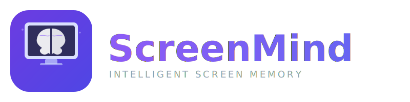

<p align="center">
  
</p>

<h1 align="center">ScreenMind</h1>

<p align="center">
  <strong>Your AI-powered second brain that watches your screen so you don't have to remember everything.</strong>
</p>

<p align="center">
  <a href="#installation">Install</a> ·
  <a href="#how-it-works">How It Works</a> ·
  <a href="#features">Features</a> ·
  <a href="#privacy">Privacy</a> ·
  <a href="https://github.com/pkmdev-sec/screenmind/releases">Download</a>
</p>

<p align="center">
  
  
  
  
  
</p>

---

## The Problem

You're deep in a research rabbit hole. Tabs everywhere. You find *that one Stack Overflow answer*, *that perfect API doc*, *that Slack message with the decision your team made*. Two hours later... gone. You can't find it. You can't even remember which app it was in.

**Sound familiar?**

We've all been there. Our screens show us hundreds of important things every day, and our brains just weren't built to remember them all.

## The Solution

**ScreenMind** sits quietly in your menu bar and does one thing really well: it watches what's on your screen, understands what matters, and writes it down for you.

No manual screenshots. No copy-pasting into notes. No "I'll bookmark this later" promises you never keep.

It just... remembers. So you can focus on the work instead of worrying about losing context.

<p align="center">
  
</p>

## How It Works

ScreenMind runs a smart 7-stage pipeline that's designed to be invisible:

```
Screen Capture → Change Detection → OCR → Content Dedup → AI Analysis → Storage → Obsidian Export
```

1. **Captures** your screen at smart intervals (not a video recorder — think periodic snapshots)
2. **Detects** when something meaningful changes (ignores idle screens, repeated content)
3. **Reads** the text on screen using Apple's native Vision OCR
4. **Deduplicates** aggressively — if you're staring at the same page, it won't create 50 notes about it
5. **Analyzes** the content with Claude AI to decide: *"Is this worth remembering?"*
6. **Generates** a structured note with title, summary, key details, tags, and links
7. **Saves** to local SwiftData + exports beautiful Markdown to your Obsidian vault

The AI is opinionated about quality. It skips lock screens, password dialogs, build logs, and boring system UI. It only creates notes when there's something genuinely worth remembering tomorrow.

## Features

**Smart Capture**
- Intelligent screen capture with active-window cropping
- Configurable intervals (5s active / 30s idle)
- Automatic pause on low battery
- Excluded apps list (skip sensitive or noisy apps)

**AI-Powered Notes**
- Claude Sonnet generates structured, actionable notes
- Extracts URLs, code snippets, decisions, action items, and key data points
- Smart categorization: coding, research, meetings, communication, reading, terminal
- Obsidian-compatible wiki-links and tags

**Aggressive Deduplication**
- 5-layer dedup defense so you never get spammed with duplicate notes
- Perceptual image hashing (detects visual similarity)
- Jaccard text similarity (fuzzy matching — catches near-duplicates)
- Cooldown timers prevent note floods
- AI-level skip detection for same-activity patterns

**Privacy First**
- Everything runs locally on your Mac. Your screen data never leaves your machine.
- AI processing uses your own API key — no middleman servers
- OCR happens on-device via Apple Vision
- Passwords, credentials, and sensitive dialogs are automatically skipped
- Full data deletion available in one click

**Obsidian Integration**
- Auto-exports notes as Markdown to your Obsidian vault
- Daily folders: `ScreenMind/2025-01-15/`
- Daily summaries with category breakdowns and app usage stats
- Wiki-links connect related topics across your knowledge base

**System Integration**
- Global keyboard shortcuts: `⌘⇧N` toggle, `⌘⇧P` pause, `⌘⇧S` browse notes
- Spotlight indexing — find your notes from anywhere
- Native macOS notifications when notes are created
- Battery-aware — pauses automatically when power is low

## Installation

### Download (Recommended)

1. Grab the latest `.dmg` from [Releases](https://github.com/pkmdev-sec/screenmind/releases)
2. Drag **ScreenMind.app** to your Applications folder
3. Launch it — you'll see a brain icon in your menu bar
4. Grant **Screen Recording** permission when prompted
5. Add your [Anthropic API key](https://console.anthropic.com/) in Settings
6. That's it. ScreenMind starts watching and noting automatically.

### Build from Source

```bash
git clone https://github.com/pkmdev-sec/screenmind.git
cd screenmind
swift build -c release
```

The binary will be at `.build/release/ScreenMind`. To create a proper `.app` bundle, check the `scripts/` directory.

## Requirements

- **macOS 14.0** (Sonoma) or later
- **Anthropic API key** — [Get one here](https://console.anthropic.com/) (Claude Sonnet usage is very affordable)
- **Screen Recording permission** — required to capture screen content
- ~150MB RAM (optimized from 500MB+ in early builds)

## Architecture

ScreenMind is built as a clean Swift Package Manager project with 8 independent modules:

```
ScreenMindApp          ← Main app (SwiftUI menu bar)
  ├── PipelineCore     ← Orchestrates the full capture-to-note pipeline
  │   ├── CaptureCore       ← Screen capture via ScreenCaptureKit
  │   ├── ChangeDetection   ← Perceptual hashing (dHash) + threshold filtering
  │   ├── OCRProcessing     ← Apple Vision text recognition
  │   ├── AIProcessing      ← Claude API client + response parsing
  │   ├── StorageCore       ← SwiftData persistence + Obsidian Markdown export
  │   └── SystemIntegration ← Keyboard shortcuts, Spotlight, notifications, power monitoring
  └── Shared           ← Constants, logging, keychain, utilities
```

Every module is actor-isolated for thread safety. The pipeline uses `AsyncStream` with backpressure control to prevent frame pileup. Error boundaries with exponential retry keep the pipeline running even when individual stages fail.

## Configuration

All settings are accessible from the menu bar → Settings:

| Setting | Default | Description |
|---------|---------|-------------|
| Capture Interval | 15s | How often to capture the screen |
| Note Cooldown | 60s | Minimum time between notes |
| Obsidian Vault | `~/Desktop/pkmdev-notes` | Where Markdown notes are exported |
| Excluded Apps | *(none)* | Bundle IDs to skip (comma-separated) |
| API Key | *(required)* | Your Anthropic API key |

## Privacy

We take your screen data seriously:

- **No cloud storage.** Notes live in SwiftData on your Mac and optionally in your local Obsidian vault.
- **No telemetry.** We don't collect usage data, analytics, or crash reports.
- **Your API key, your calls.** AI requests go directly from your Mac to Anthropic's API. We never see your data.
- **Automatic credential skipping.** The AI is instructed to never capture passwords, login dialogs, or sensitive information.
- **One-click delete.** Settings → Privacy → Delete All Data removes everything instantly.

## Contributing

ScreenMind is open source and we'd love your help! Here's how:

1. **Fork** the repo
2. **Create** a feature branch (`git checkout -b feature/amazing-thing`)
3. **Commit** your changes
4. **Push** to your branch
5. **Open** a Pull Request

Some ideas for contributions:
- Support for additional AI providers (Ollama, OpenAI, local models)
- Enhanced Obsidian templates and formatting
- Calendar integration for meeting detection
- Browser extension for richer web context
- iOS companion app for reading notes on the go

## License

MIT License — see [LICENSE](LICENSE) for details.

---

<p align="center">
  <strong>Built with frustration about forgetting things, and love for the Mac.</strong>
  <br/>
  <sub>If ScreenMind saved you from losing an important piece of context, consider giving it a star.</sub>
</p>
